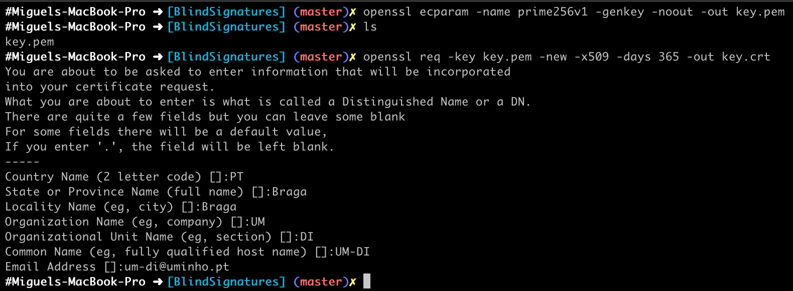
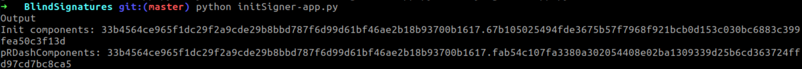
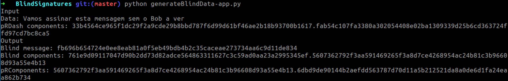
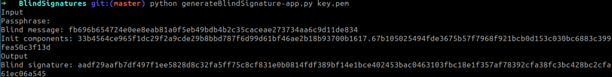
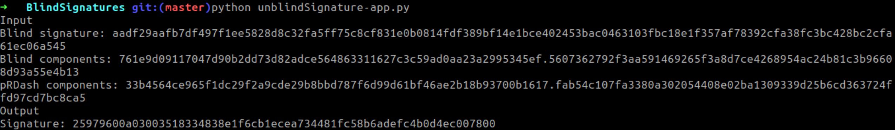
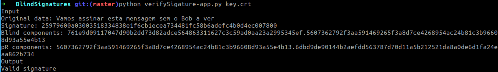

# Aula TP - 18/Fev/2019


## Assinaturas cegas baseadas em ECDLP (Elliptic Curve Discrete Logarithm Problem)

### Experiência 1.1
A invocação da sequência de comandos:

```
$ openssl ecparam -name prime256v1 -genkey -noout -out key.pem
$ openssl req -key key.pem -new -x509 -days 365 -out key.crt
```

resulta na criação de dois ficheiros [`key.pem`](BlindSignatures/key.pem) e [`key.crt`](BlindSignatures/key.crt) que consistem na chave privada e
certificado para assinatura associado à mesma, respetivamente.



### Experiência 1.2

O processo de assinatura cega compreende cinco fases distintas que permitem transformar os dados a serem assinados de maneira a que 
a assinatura dos dados ofuscados possa ser convertida numa assinatura válida dos dados desofuscados.
Como tal de seguida apresenta-se o resultado de realizar cada uma dessas fazes em sequência:

1. Inicialização: 



2. Ofuscação:



3. Assinatura:




4. Desofuscação:




5. Verificação:



### Pergunta 1.1
