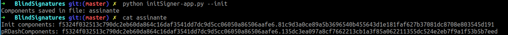
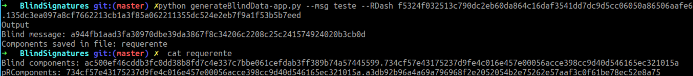
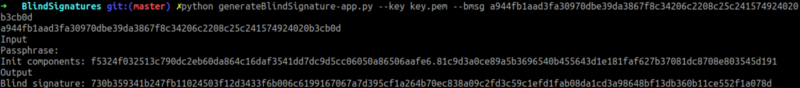
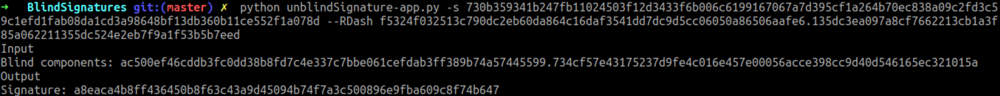
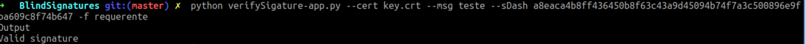

# Aula TP - 18/Fev/2019


## Assinaturas cegas baseadas em ECDLP (Elliptic Curve Discrete Logarithm Problem)

### Experiência 1.1
A invocação da sequência de comandos:

```
$ openssl ecparam -name prime256v1 -genkey -noout -out key.pem
$ openssl req -key key.pem -new -x509 -days 365 -out key.crt
```

resulta na criação de dois ficheiros [`key.pem`](BlindSignatures/key.pem) e [`key.crt`](BlindSignatures/key.crt) que consistem na chave privada e
certificado para assinatura associado à mesma, respetivamente.


### Experiência 1.2

O processo de assinatura cega compreende cinco fases distintas que permitem transformar os dados a serem assinados de maneira a que 
a assinatura dos dados ofuscados possa ser convertida numa assinatura válida dos dados desofuscados.
Como tal de seguida apresenta-se o resultado de realizar cada uma dessas fases em sequência:

1. Inicialização: 


2. Ofuscação:


3. Assinatura:


4. Desofuscação:


5. Verificação:


### Pergunta 1.1

Para suportar as funcionalidades requisitadas foi usado o módulo `getopt` que permite especificar um conjunto 
predefinido de opções de linha comandos (e valores caso aplicável).

Como tal, no caso do ficheiro [`init-app.py`](BlindSignatures/init-app.py), foi usada a seguinte invocação que 
define como argumento `--init`: 
```
args, _ = getopt.getopt(sys.argv[1:], "", ["init"])
```
Quando esta opção se encontra presente é gerado um ficheiro chamado "assinante" que contém os parametros 
**InitComponents** e **pRDashComponents**:

```
initComponents, pRDashComponents = eccblind.initSigner()
sig_file = open("assinante", "w")
sig_file.write("Init components: %s\n" % initComponents)
sig_file.write("pRDashComponents: %s\n" % pRDashComponents)
sig_file.close()
```
Após ter sido invocado o comando `$ python init-app.py --init` que cria o ficheiro "assinante", o assinante pode consultar 
o parametro **pRDashComponents** invocando apenas `$ python init-app.py`:

```
initComponents, pRDashComponents = tuple(open("assinante", "r").readlines())
pRDashComponents = pRDashComponents.split(' ')[1]
print("pRDashComponents: %s" % pRDashComponents)
```




A ofuscação de dados por parte do requerente é conseguinda com recurso ao comando 
`$ python generateBlindData-app.py --msg <msg> --RDash <pRDashComponents>` implementado pelo *script* [`ofusca-app.py`](BlindSignatures/ofusca-app.py).
Como no caso do `init-app.py`, este define o conjunto de argumentos esperados e respetivos valores:
```
args, _ = getopt.getopt(sys.argv[1:], "", ["msg=", "RDash="])
```
O valor da mensagem e do **RDash** é lido dos argumentos passados ao *script* sendo obtida uma representação ofuscada dos dados:



A assinatura dos dados ofuscados é conseguida através do *script* [blindSignature-app.py](BlindSignatures/blindSignature-app.py) que 
deve ser invocado da seguinte maneira `$ python generateBlindSignature-app.py --key <pkey.pem> --bmsg <message>`.
A chave privada é identificada pelo ficheiro PEM onde está armazenada e a mensagem ofuscada deve ser passada como valor associado à 
opção `--bmsg`:
```
args, _ = getopt.getopt(sys.argv[1:], "", ["key=", "bmsg="])
args = dict(args)
if "--key" in args:
        eccPrivateKeyPath = args["--key"]
        if "--bmsg" in args:
            blindM = args["--bmsg"]
```
Neste caso é ainda requisitada a introdução, por parte do utilizador, dos componentes **passphrase** (palavra passe associada à chave privada)
e **initComponents** sendo gerada a assinatura da mensagem ofuscada:



A desofuscação da assinatura é realizada pelo requerente com recurso ao *script* [desofusca-app.py](BlindSignatures/desofusca-app.py)que invoca o 
comando `$ python unblindSignature-app.py -s <Blind Signature> --RDash <pRDashComponents>` indicando a assinatura ofuscada bem como o valor de 
**pRDashComponents** no respetivo argumento:
```
args, _ = getopt.getopt(sys.argv[1:], "s:", ["RDash="])
args = dict(args)
if "-s" in args:
    blindSignature = args["-s"]
    if "--RDash" in args:
        pRDashComponents = args["--RDash"]
```
sendo posteriormente requisitado o valor dos **BlindComponents** `blindComponents = raw_input("Blind components: ")`.



A verificação da assinatura é conseguida com recurso ao *script* [verify-app.py](blindSignature/verify-app.py), devendo ser indicado
o certificado associado à chave privada usada para assinar os dados bem como a mensagem original(desofuscada) e a respetiva assinatura:
`$ python verifySignature-app.py --cert <certificate.crt> --msg <msg> --sDash <signature> -f <requerente>`
Os componentes **BlindComponents** e **pRComponents** são lidos do ficheiro passado como argumento de `-f`:
```
if "-f" in args:
    blindComponents, pRComponents = tuple(open(args["-f"], "r").readlines())
    blindComponents = blindComponents.split(' ')[2]
    pRComponents = pRComponents.split(' ')[1]
```


