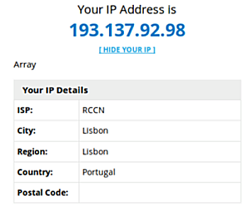
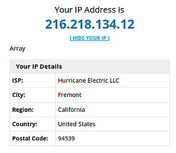
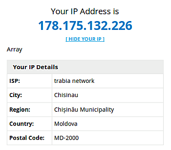
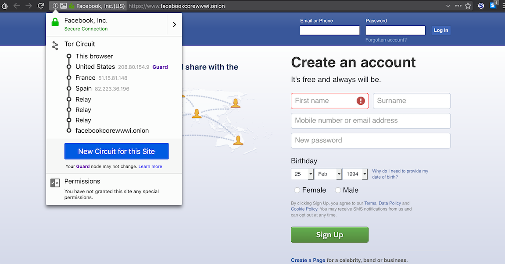

# Aula TP - 25/Fev/2019

## Exercícios

### 1\. TOR (The Onion Router)

#### Experiência 1.1

Utilizou-se nesta experiência o TOR (através do comando linha `anonsurf`) para mudarmos a nossa localização geográfica:

1. Abriu-se o browser e registou-se o endereço IP e localização através do site <http://myiplocator.net/> (Note-se que se obtém os mesmos resultados recorrendo ao comando `sudo anonsurf myip`)

2. Na linha de comando executou-se `sudo anonsurf start`
3. Fez-se reload (shift-reload) da página web atual e registou-se novamente o endereço IP e localização. 

Observe-se que se o mesmo não tivesse mudado , é porque existiu algum erro.

4. Na linha de comando executou-se `sudo anonsurf change`
5. Fez-se reload (shift-reload) da página web novamente e mais uma vez recolheu-se o endereço IP e a localização, verificando-se mais uma vez que o mesmo sofreu alterações.

6. Na linha de comando executou-se `sudo anonsurf stop`
7. Por fim, fez-se reload (shift-reload) da página web e apontou-se o endereço IP e localização.

Note-se que os dados aqui obtidos coincidem com os valores inicialmente recolhidos, tal como era de esperar.

#### Resposta à Pergunta P1.1

**Para aceder a alguns sites nos EUA tem que estar localizado nos EUA.**

**1. Efetuando o comando `sudo anonsurf start` consegue garantir que está localizado nos EUA?**

Ao executar o comando `sudo anonsurf start` não é possível garantir que se está localizado nos EUA, devido ao protocolo TOR. No entanto, existem mecanismos disponíveis para que um utilizador especifique qual o país do último nodo (Onion Router). Assim, para garantir que o OR esteja localizado nos EUA basta acrescentar no ficheiro **/etc/tor/torrc** a linha **ExitNodes {us} StrictNodes 1** e verificar o pretendido executando novamente o comando `sudo anonsurf start`.

(FONTE: <https://www.torproject.org/docs/faq.html.en#ChooseEntryExit>)

**2. Porquê? Utilize características do protocolo TOR para justificar.**

O protocolo associado ao TOR rege-se pelo anonimato ponto-a-ponto, assim numa rede TOR, o utilizador não tem controlo sobre quais os OR (onion routers) a que se conecta, não sabendo qual é a sequência de OR nem qual é o OR final.

A aplicação TOR do lado do cliente (onion proxy ou OP) executa um pedido ao Directory Server (DS), possuindo a característica de saltar, entre circuitos, em intervalos de duração de 1 minuto. Nesta aplicação, o DS responde com uma lista de, por norma 3, OR, estabelecendo uma chave simétrica com cada um deles. Posteriormente, o OP cria um circuito composto por esses OR através de um algoritmo que implementa um determinado critério de escolha. Neste processo não existe qualquer ação determinada pelo utilizador, graças ao processo de seleção aleatória de OR's, não sendo assim possível determinar qual o OR ao qual o Op se vai conectar, gerando deste modo localizações de carácter aleatório e fictício.

(FONTE:<https://pt.wikipedia.org/wiki/Tor_(rede_de_anonimato)>)

#### Experiência 1.2

A. Observação do circuito do site <https://blog.torproject.org/italian-anti-corruption-authority-anac-adopts-onion-services>:

B. Observação do circuito do site <https://www.expressvpn.com/blog/best-onion-sites-on-dark-web/>:

#### Pergunta P1.2

No seguimento da experiência anterior, acedeu-se a <https://www.facebookcorewwwi.onion/> e verificou-se o circuito para esse site:

**Porque existem 6 "saltos" até ao site Onion, sendo que 3 deles são "_relay_"? Utilize características do protocolo TOR para justificar.**

Os 6 "saltos" são o resultado de existir anonimato entre ambas as partes envolvidas na conexão, garantindo o tal anonimato ponto-a-ponto. Os primeiros 3 saltos correspondem aos OR fornecidos pelo Directory Server para o utilizador se conectar, de forma anónima, ao serviço destino, e os 3 relays referem-se aos OR do circuito criado pelo OP de destino.

Inicialmente o utilizador começa por aceder ao DS (Directory Server) para obter informação sobre os IP (Introduction Points) e a chave pública do serviço anónimo XYZ.onion. Depois de os IP's estarem escolhidos é criado um circuito TOR até um RP (Rendezvous Point), para o mesmo ser conectado com o serviço anónimo, fornecendo-lhe um rendez-vouz cookie (um segredo aleatório único para posterior reconhecimento do XYZ.onion).

Os "rendezvous points", permitem que os utilizadores se conectem aos serviços Onion, anteriormente conhecidos como serviços ocultos, sem que cada um conheça a identidade da rede do outro.

O utilizador do serviço abre uma stream até um dos IP's do serviço anónimo a quem envia uma mensagem, cifrada com a chave pública do serviço anónimo, com a informação sobre o RP, o rendez-vouz cookie e a sua parte da chave de sessão Diffie-Hellman. O serviço anónimo, para responder ao utilizador, constrói um circuito TOR até ao RP do utilizador, enviando uma mensagem com o rendez-vouz cookie, a sua parte da chave Diffie-Hellman e o Hash da chave partilhada. 

Assim, existe entre o utilizador e o serviço anónimo um circuito de 6 OR's onde cada uma das partes tem apenas conhecimento de metade do circuito. Desta forma, o utilizador do serviço anónimo tem conhecimento dos três OR's até ao RP, mas a partir daí os saltos são relay porque o utilizador não possuí nenhuma informação sobre eles.

(FONTE:<https://www.torproject.org/docs/onion-services.html.en, https://www.torproject.org/about/overview.html.en>)

