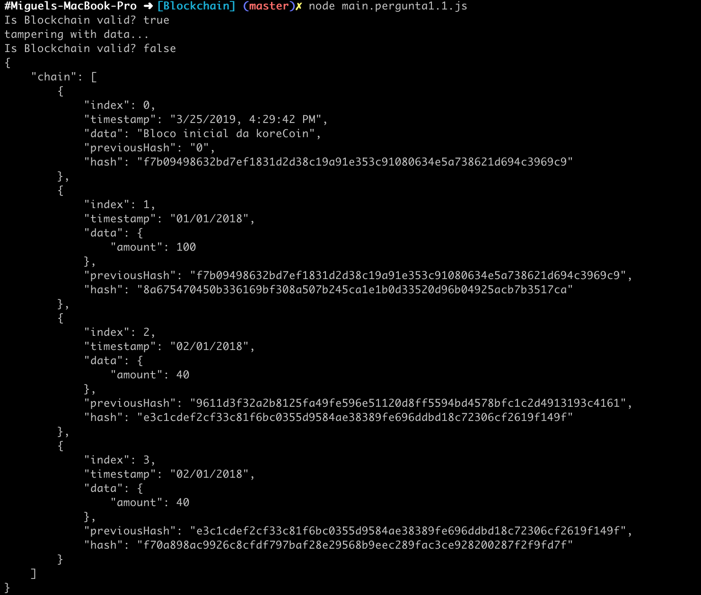
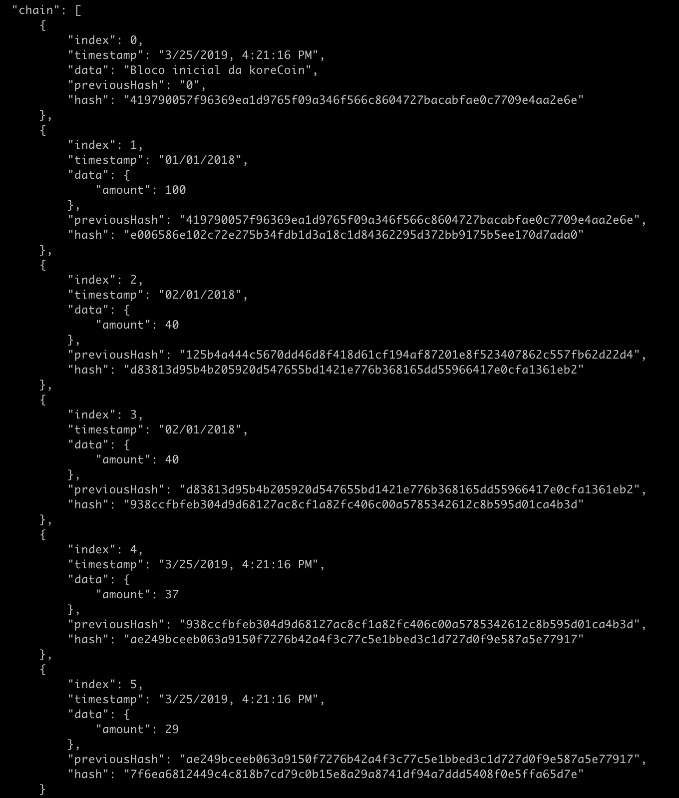

# Aula TP - 25/Mar/2019

## Blockchain


### Pergunta 1.1
O *GenesisBlock* é criado pelo construtor da classe `Blockchain` invocando a função `createGenesisBlock`:
```
return new Block(0, "02/01/2018", "Genesis Block", "0");
```
como tal, para alterar o *timestamp* e dados incluídos neste block basta alterar o segundo e terceiro
parametros respetivamente. Para obter o *timestamp* atual basta recorrer à classe `Date` e formatar a data
atual segundo o formato **UTC**:
```
var now_s = new Date(Date.now()).toLocaleString(); // get current timestamp and convert to UTC format
return new Block(0, now_s, "Bloco inicial da koreCoin", "0");
```

que resulta na mudança do *timestamp* e dados associados ao primeiro bloco:


### Pergunta 1.2

A adição de blocos é possível com recurso ao método `addBlock`, como tal é possível adicionar dois blocos
com quantias aleatórias (entre 0 e 100) e *timestamps* correspondentes ao instante de criação da seguinte
maneira:

```
koreCoin.addBlock(new Block(4, new Date(Date.now()).toLocaleString(), {amount: Math.floor(Math.random()*100)}));
koreCoin.addBlock(new Block(5, new Date(Date.now()).toLocaleString(), {amount: Math.floor(Math.random()*100)}));
```

que pode ser verificada imprimindo a *chain*:


