# Aula TP - 29/Abr/2019

## *Buffer Overflow*

### Experiência 1.1 - Organização da memória do programa

A imagem abaixo apresenta o *output* resultante da execução dos comandos enunciados.
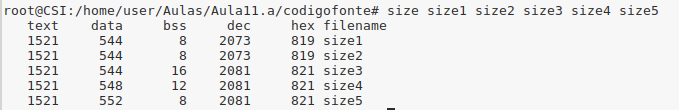

São assim apresentados os valores nos vários segmentos de texto, dados e bss de cada um dos ficheiros.

- **Segmento de texto**

Também conhecido como Segmento de código, é uma porção de um *object file* ou a secção correspondente do espaço de endereço virtual do programa que contém instruções executáveis.

O mesmo valor em todos os ficheiros deve-se ao facto de este segmento de código, na memória, ser tipicamente apenas de leitura e ter tamanho fixo.


- **Segmento de dados**

O segmento de dados é uma porção de um *object file* ou o espaço de endereço virtual correspondente a um programa que contém variáveis estáticas inicializadas, isto é, variáveis globais e variáveis locais estáticas.

O tamanho desse segmento é determinado pelo tamanho dos valores no código-fonte do programa e não é alterado em tempo de execução.

O ficheiro `size4.c` possui uma variável estática inicializada e o ficheiro`size5.c` possui duas, daí o aumento, de 4 *bytes* por variável, do segmento de dados netes ficheiros. Os restantes ficheiros não apresentam variáveis inicializadas, daí possuirem o mesmo valor.


- **BSS (Block Started by Symbol)**

O nome .bss ou bss é usado por muitos compiladores e *linkers* para a parte de um arquivo objeto ou executável contendo variáveis alocadas estaticamente que não são explicitamente inicializadas para qualquer valor.

Apesar de o ficheiro `size1.c` não possuir variáveis guardadas no bss, este ocupa o mesmo valor que o `size2.c`, pois quando o programa carrega, são alocados 8 bits por definição. Já o `size5.c` possui duas variáveis inicializadas, logo são alocados 8 *bytes* (4 + 4).

O ficheiro `size3.c` possui o dobro da memória no bss comparativamente com o size1.c, pois contém duas variáveis não inicializadas, invés de apenas uma, justificando assim os 16 *bytes* em vez dos 8.

Como o ficheiro `size4.c` possui uma variável não incializada e outra inicializada, o segmento bss ocupa 12 *bytes* (8 + 4), pois para uma variável inicializada a memória alocada é metade.

(FONTES: https://en.wikipedia.org/wiki/Code_segment; https://en.wikipedia.org/wiki/Data_segment; https://en.wikipedia.org/wiki/.bss)

### Experiência 1.2 - Organização da memória do programa

Segue-se a imagem dos resultados da utilização do programa memoryLayout.c para verificar o *layout* da memória do programa.


Note-se ainda que os valores dos segmentos text, data e bss do programa size *memorylayout* são completamente diferentes em relação aos 5 anteriores:

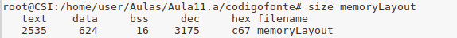

### Experiência 1.3 - *Buffer overflow* em várias linguagens

A execução do programa em Java faz o valor de i variar automáticamente entre 0 a 9, no Python varia de 0 a 10 e em C++ os valores de i variam ilimitadamente de 7 a 10. Adicionalmente, os programas de Java e de Python terminam com uma exceção porque se tenta aceder a um índice inválido do *array*. Já com programa em C++ isto não ocorre, pois não existe verificação dos limites do *array*. Mais ainda, quando o programa escreve na posição 10 do *array*, que já se encontra fora do limite, está, na realidade, a escrever na variável i, que é alterada para o valor 7, fazendo com que o programa entre assim em *loop*.

As imagens de seguida ilustram o que foi acabado de afirmar.
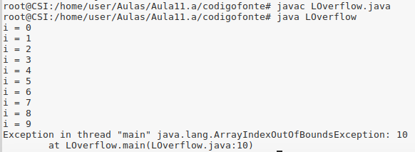
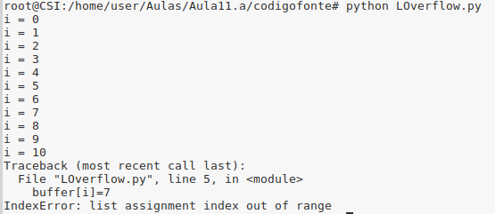
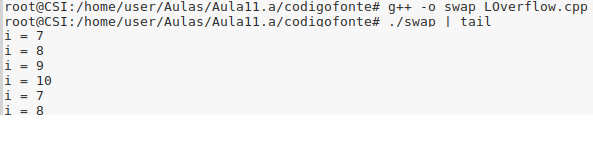

### Resposta à pergunta P1.1 - *Buffer overflow* em várias linguagens

Tanto no programa Java como no Python existe um controlo de acesso de memória que impede a escrita numa zona de memória que não esteja previamente declarada para o efeito e, consequentemente impede vuneralibidades de *buffer*. Assim, quando se tenta aceder a um índice superior aos do *array* (por exemplo índice 10 num array com 10 elementos, em que o maior é 9) é obtida uma exceção indicando que a posição está "fora dos limites". Tal como se pode verificar com as imagens seguinte:

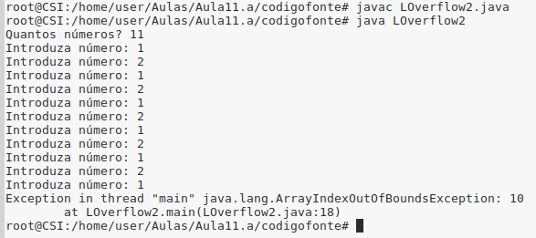
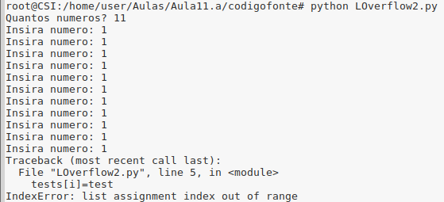


Já no programa em C++ o mesmo não acontece, uma vez que não existe controlo de acesso automático por parte do sistema. A partir do índice do tamanho do array definido, o programa vai escrevendo na posição de memória adjacente. 

Deste modo, quando se tenta aceder a um índice superior ao do limite no *array*, o programa não apresenta nenhuma exeção, como os anteriores, sendo possível escrever além do limite do *buffer*. No entanto são possíveis dois comportamentos distintos, dependendo do *input* introduzido:

- O programa é forçado a parar, devolvendo Segmentation Fault, quando escrevemos para além do limite do *array* e introduzirmos um valor que também se encontra fora do limite do *array*.

- O programa entra em *loop*, ao escrevemos além do limite do *array* e introduzirmos um valor que se encontre dentro do limite do *array*.


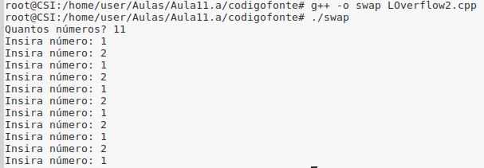
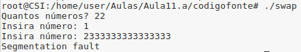


### Resposta à pergunta P1.2 - *Buffer overflow* em várias linguagens

O que sucede nesta situação é semelhante ao que acontecia anteriormente, pois tanto no Java como no Python os programas impedem o acesso a regiões de memória fora do que foi declarado na criação do *buffer*. No entanto, no programa C++ é permitido o acesso a posições de memória fora do *buffer*.

Ao executar os programas LOverflow3.java e LOverflow3.py, estes dão excepções interessantes de analisar. O primeiro, caso o programa coloque num *array* os valores ordenados de forma decrescente, até 10 posições, o programa apresenta erro ao correr qualquer valor maior que 10, pois não é possível guardar mais do que 10 elementos no *array*. Também, ao recuperar um valor negativo aparece igualmente um erro, no entanto, quando se guarda, por exemplo, 4 valores no *array* e depois se pede para recuperar o oitavo valor não dá qualquer erro e devolve ainda que o valor guardado nessa posição é 0.


No LOverflow3.py, se o programa coloca num *array* os valores ordenados de forma decrescente, até 10 posições, então também aqui surge erro, quando se pretende guardar mais que 10 valores no *array*, sendo este o tamanho definido pelo mesmo. No entanto, contrariamente ao anteroir, quando se pretende recuperar um valor negativo, não surge nenhum erro e retorna None.


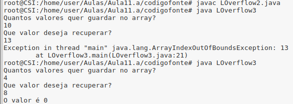
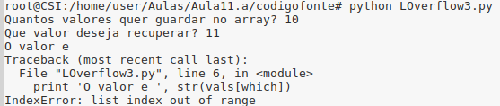

Já o programa LOverflow3.cpp, ao tentar aceder a um índice do *array* superior ao que este permite, o programa não pede o valor para recuperar e fica em modo de espera porque a memória disponível do *array* foi ultrapassada. Adicionalmente, quando se pretende recuperar valores negativos, este programa retorna 0 e quando se pretende recuperar um valor maior do que o número de valores guardados, o valor obtido corresponde ao endereço de memória.


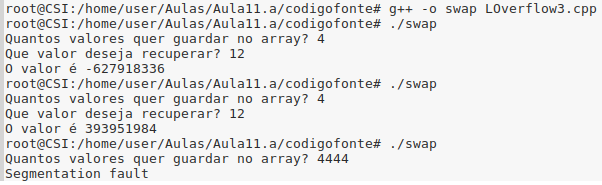


### Experiência 1.4 - *Buffer overflow* em várias linguagens

Relativamente às temperaturas 30.0 30.1 30.2 30.3 30.4 30.5 30.6 20.7 30.8 30.9, tanto o program em Java como em Python conseguem ler as 10 temperaturas, no entanto, ultrapassando esse valor, tal já nãose verifica e ambos retornam erro.

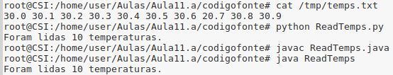
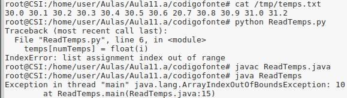


### Resposta à pergunta P1.3 - *Buffer overflow*

Em ambos os programas existe uma vulnerabilidade de *buffer overflow* na *stack*.

- Programa `RootExploit.c


Neste programa a vulnerabilidade de *buffer overflow* existe porque a função *gets* não valida o tamanho do *input*, e provém de se de se introduzir uma *password* sem o limite minimo de 5 caracteres exigidos (`char buff[4]`). Desta forma, é possível escrever na variável *pass* caso se insira um *input* com tamanho superior a 4. Assim, para obter a mensagem "São atribuidas permissões de admin" basta que a variável *pass* tenha uma valor diferente de 0, ou seja, basta apenas inserir na *password* uma *string* com 5 caracteres, mesmo que a *password* esteja errada.


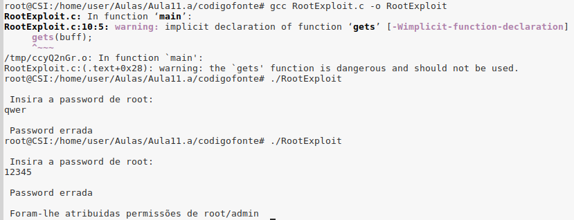


-Programa `0-simple.c`

No ficheiro 0-simple.c a vulnerabilidade existe e é explorada pelas mesmas razões do exemplo anterior, no entanto, o tamanho do input necessário para explorar a vulnerabilidade tem que ser superior em mais do que uma unidade ao tamanho do *buffer*. Este facto pode estar relacionado com o alinhamento de memória forçado pelo compilador. A vulnerabilidade neste programa advém assim de não se ter em consideração se o *input* é maior que o *buffer* (`char buffer[64]`),tal como é exigido. Facilmente alterando a variável *control* para um valor diferente de 0, i.e., introduzindo caracteres que ultrapassem esse limite, é simples obter a mensagem "YOU WIN!!!" 

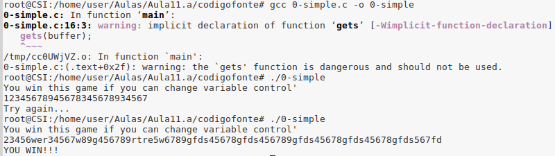


### Experiência 1.5 - *Formatted* I/O

Na **função segura()**, o *output* da função *printf* é formatado pela *string* "%s", pelo que qualquer sequência de formatação no *input* ("%s", "%d", "%p",...) será lida de forma literal, i.e. o *output* não será expandido para substituir as ocorrências destes padrões.

Já na **função vulnerável()**, como a *string* passada à função *printf* é exatamente aquela que é lida, caso esta contenha alguma sequência de formatação, esta vai ser substituída por um valor indeterminado, uma vez que não é passado nenhum argumento adicional.

Segue-se uma imagem que ilustra o que aqui foi dito:

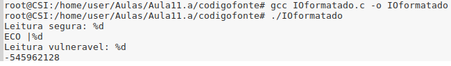


### Resposta à pergunta P1.4 - *Read overflow*

O programa ReadOverflow é responsável por fazer *echo* de um determinado número de caracteres previamente definidos pelo utilizador. 
A primeira caracteristica deste a destacar é o facto de que o valor de *p* passa a ser igual ao valor de *buf*, caso a função *fgets* não retorne NULL. 
Outa característica é a de que o programa não verifica qual o tamanho máximo permitido de carateres a serem introduzidos como *input*. Assim, a vulnerabilidade existente neste programa deve-se ao facto de este ler mais informação que a que era suposta. Se o utilizador só escolher inserir 6 caracteres, por exemplo, não deveria ser possível inserir mais, pois o programa iria ler *bytes* de memória fora da *stack* (pois o *buffer* é a primeira variável local do programa). Isso seria particularmente perigoso, pois o utilizador ao inserir um valor maior que o devido poderia adquirir informação de zonas de memória não permitidas, com conteúdo sensível.

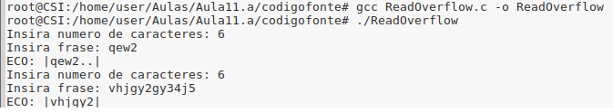


### Resposta à pergunta P1.5

*Little- endian* e *Big-endian*, são duas formas distintas de representação de um determinado tipo de dados. A primeira começa por representar o valor menos significativo até ao mais significativo, enquanto a segunda começa pelo mais significativo até ao menos significativo.

A dificuldade de modificar um valor de uma variável específica para um valor específico vem da necessidade de saber exatamente onde esta está, qual o seu tipo (quanto espaço ocupa), se a arquitetura é *little-endian* ou *big endian* e saber como colocar lá o valor.

Para conseguirmos obter mensagem de "Congratulations" temos de alterar o valor da variável *control* para 0x61626364 de forma a entrar na condição verdadeira do ciclo. 

Sabendo que a arquitetura em ambientes UNIX é *little-endian*, e que para introduzir dois ou mais *bytes* para obter um número específico estes têm de ser colocados numa ordem tal que permita que o byte menos significativo fique numa posição de memória com um enderço mais baixo. Assim, para introduzir o valor 0x61626364, é necessário intorduzir o byte 0x64 primeiro, e assim sucessivamente.

Deve-se então inserir 64 + 12 caracteres (para preencher a memória necessária neste programa até ser possível alterar a variável) e depois inverte-se o endereço 0x61626364 (\x64\x63\x62\x61).

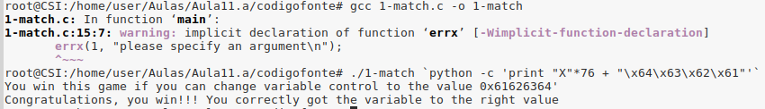

Uma outra alternativa para a resolução desta questão é tendo em conta o funcionamento da *stack*. Sabemos que o *buffer* tem 64 *bytes* (sendo 1 *byte* o espaço alocado na memória para cada caracter) e que o endereço de *buffer* ocupa 8 *bytes*, assim, este ocupa 72 *bytes* em memória. Adicionalmente, o endereço de retorno ocupa 4 *bytes*, o que conduz a termos que escrever 76 *bytes* antes de conseguirmos escrever em memória na variável de *control*.

Uma vez que o valor a obter é 0x61626364 e tendo em conta que tal corresponde à *string* "abcd", em ascii, e como a arquitetura é *little-endian*, a conversão da *string* anterior, nessa arquiterura, corresponde a efectuar a ordem inversa: "dcba".

Posto isto, para receber a mensagem pretendida basta chamar o programa com um argumento de 76 *bytes* seguido da *string* "bcda".

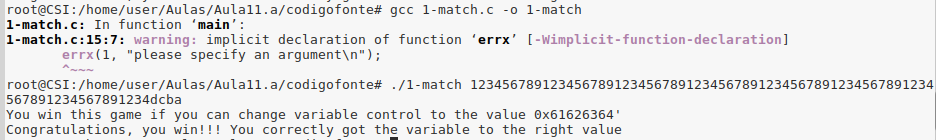


## 2\. Vulnerabilidade de inteiros


### Resposta à pergunta P2.1

#### Alínea A

A vulnerabilidade presente na **função vulneravel()** diz respeito aos argumentos, mais especificamente a x e y, que representam as dimensões usadas na alocação de memória da matriz. 

Note-se que o primeiro ciclo, por exemplo, só termina quando *i* é superior a *x* e uma vez que x é do tipo size_t com um tamanho de 8 *bytes*, o seu valor máximo será 2^64, quando o valor máximo de i (um int de 4 *bytes*) for 2^31-1. Caso x contenha um valor maior que o máximo dos int, o ciclo tentará incrementar i, causando um *overflow*.

Assim sendo, ao atribuir valores elevados a estes dois inteiros, pode se exceder o limite superior do tipo size_t, pelo que os mesmos seriam convertido em números menores. Devido a este factor de risto, possivelmente se começaria a escrever e corromper os dados de locais da memória não pré-destinados para esta função.


#### Alínea 2

```C
int main() {
	char * matriz;
	vulneravel(matriz, 670000000,690000000, '150');
} 
```

Observe-se que o **main()** foi completado com valores superiores ao valor máximo do tipo *int* na máquina.

#### Alínea 3

Ao executar o programa, obtem-se o erro *Segmentation Fault*. Isto deve-se ao facto de não ser alocada a memória necessária, pelo simples facto de o número convertido ser inferior ao que se realmente se pretende como tamanho, o que irá fazer com que se tente alterar porções de memórias não alocada.

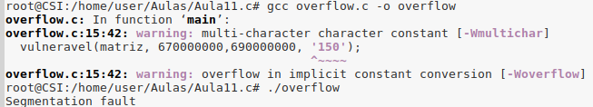

### Resposta à pergunta P2.2

#### Alínea 1

Neste programa, a vulnerabilidade na **função vulneravel()** está mais uma vez relacionada com a variável tamanho, passada como argumento. A função não estabelece um limite inferior, pois a variável *tamanho_real* só estabelece o limite superior. Desta forma, se for passado como tamanho o valor 0, à variàvel *tamanho_real*, será atribuído o valor -1. Observe-se que a situação de *overflow* já é considerada.

#### Alínea 2


```C
int main() {
	char origem[10] = "mensagem";
	vulneravel(origem, 0);
} 
```

#### Alínea 3

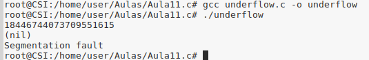

Executando o programa, obtem o erro *Segmentation Fault* pois não é conseguida alocar a memória pretendida. 

Com maior detalhe, como a função em questão apenas verifica se o argumento *tamanho* é inferior a um valor máximo, quando se define o *tamanho = 0*, a variável tamanho_real (tamanho - 1) fica com um valor muito grande (*underflow*). No entanto, a função *malloc* retorna não esse valor mas sim um apontador nulo, pois não consegue reservar espaço de memória para tal.
Assim, a função *memcpy* ao tentar aceder ao apontador nulo faz com que o programa termine com o erro já mencionado. 
