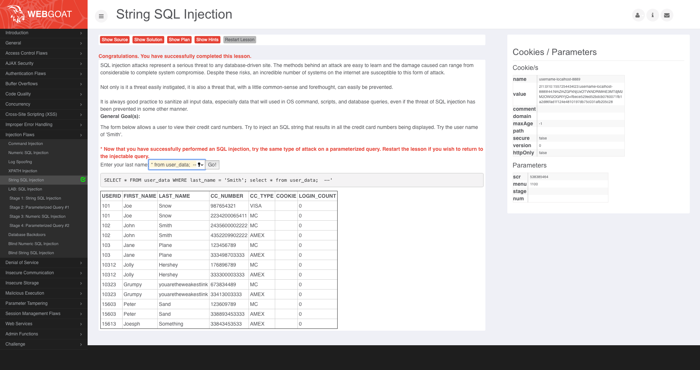
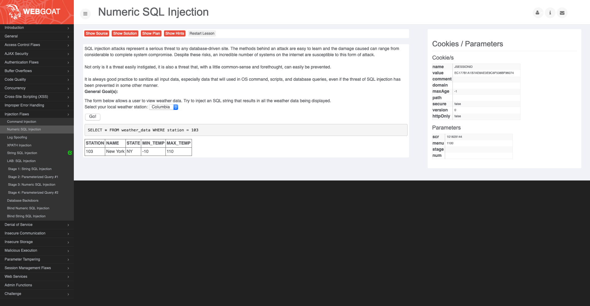
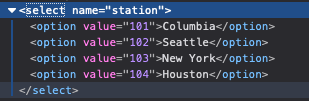
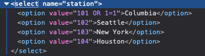
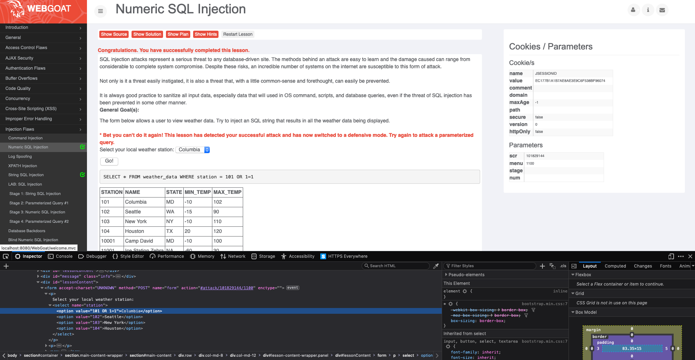
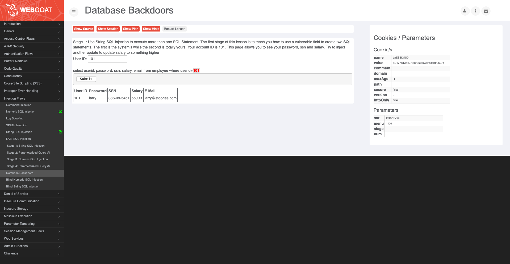
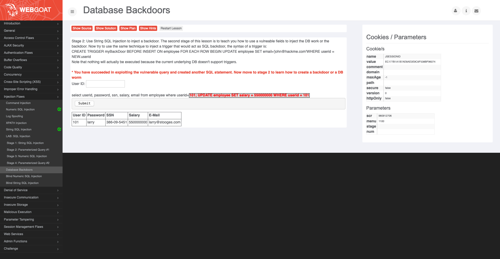

# Aula TP - 06/Mai/2019

## P1.1 - *SQL Injection*

A inserção da *string* `Smith'; select * from user_data;  --` no campo de entrada permite obter todos os dados de todos os utilizadores:

Por outro lado, o uso da *string* `Smith' OR 1=1 --` também permite obter os dados de todos os utilizadores visto que a condição `1=1` 
se trata de uma tautologia **i.e.** é verdade para qualquer utilizador:

## P1.2 - *Numerical SQL Injection*

A escolha dos valores disponíveis permite observar que a *query* é construída com um código identificador do local que se pretende
consultar:

Uma inspeção do código HTML da página permite identificar que estes valores estão presentes no atributo *value* de cada *tag* do tipo
*option*:

Como tal, para conseguir injectar SQL basta modificar este atributo de forma a que constitua uma *string* como a seguinte: `101 OR 1=1`

que resulta na *query* SQL:

permitindo visualizar todas as temperaturas presentes na base de dados:

## P1.3 - *Database Backdoors*

Construindo a *query* `101; UPDATE employee SET salary = 550000000 WHERE userid = 101;` é possível atualizar o salário de um utilizador
cujo `userid` seja igual a 101:

